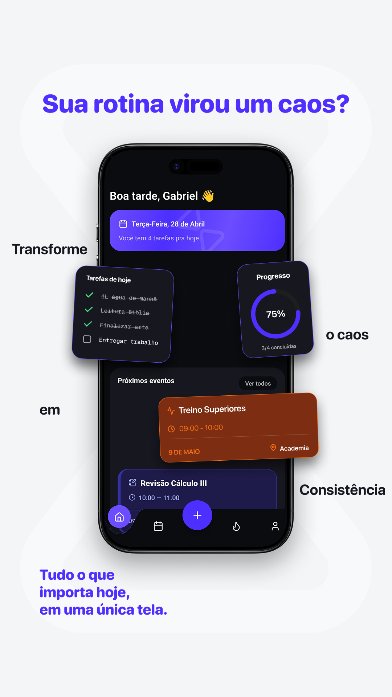
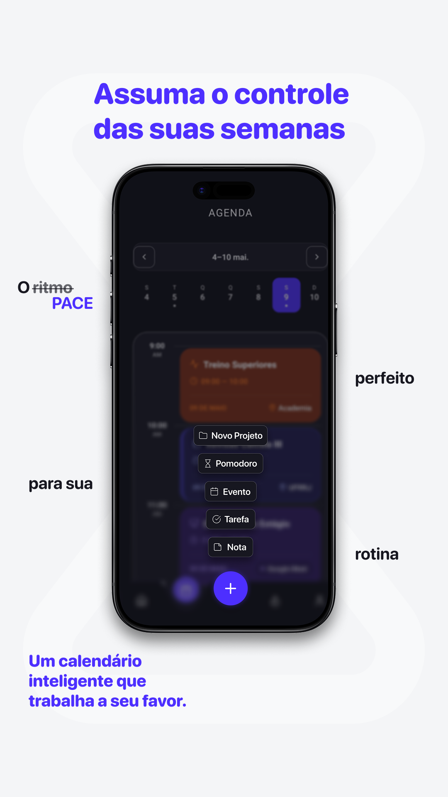

# PACE

> Plataforma de produtividade com Inteligência Artificial projetada para ajudar pessoas a organizarem projetos, notas, tarefas e eventos dentro de um sistema unificado centrado em projetos.

## Visão Geral

O PACE é uma plataforma premium de produtividade construída em torno de uma ideia simples:

**Tudo pertence a um projeto.**

Em vez de tratar notas, tarefas e eventos como informações isoladas, o PACE organiza todo o trabalho dentro de uma estrutura hierárquica de projetos, oferecendo contexto completo sobre o que está sendo feito e por que isso é importante.

A plataforma é guiada por três princípios fundamentais:

- **Contexto** — Toda nota, tarefa e evento está vinculada a um projeto.
- **Ordem** — As informações são organizadas de forma clara e estruturada.
- **Foco** — Ferramentas inteligentes ajudam o usuário a manter a produtividade e evitar o acúmulo de informações desnecessárias.

O PACE também inclui um assistente especializado em Inteligência Artificial, baseado em Retrieval-Augmented Generation (RAG), projetado para ajudar os usuários a estruturar projetos, organizar fluxos de trabalho e utilizar a plataforma de maneira mais eficiente.

---

## Principais Funcionalidades

- Organização hierárquica de projetos e pastas
- Notas em Markdown
- Tarefas e eventos
- Dashboard principal e visualização semanal
- Estatísticas de produtividade e streaks
- Onboarding personalizado
- Planos de assinatura
- Assistente de IA premium com RAG

---

## Como o PACE Funciona

O usuário inicia definindo seus objetivos e áreas de interesse durante o onboarding.

A partir disso, pode criar projetos e subprojetos para organizar diferentes áreas da vida pessoal, acadêmica e profissional. Dentro de cada projeto, é possível adicionar:

- Notas
- Tarefas
- Eventos

O PACE transforma essas informações em dashboards, timelines e insights de produtividade.

Assinantes premium têm acesso ao PACE AI, um assistente especializado que analisa a estrutura criada pelo usuário e oferece recomendações práticas para melhorar a organização e o desenho do fluxo de trabalho.

---

## Stack Tecnológica

### Frontend Mobile
- React Native
- Expo
- TypeScript

### Backend (Planejado)
- Node.js
- NestJS
- PostgreSQL
- Prisma ORM
- Autenticação com JWT
- AbacatePay

### Infraestrutura de IA
- Python
- Ollama
- LangChain
- Chroma Vector Database
- Retrieval-Augmented Generation (RAG)

---

## PACE AI

O PACE AI não é um chatbot de propósito geral.

Seu único objetivo é ajudar os usuários a compreender e utilizar o PACE de forma mais eficaz, por meio de:

- Explicação de funcionalidades da plataforma
- Sugestões de estruturas de projetos
- Recomendações de fluxos de trabalho
- Estratégias de organização
- Otimização dos sistemas de produtividade

O assistente utiliza informações contextuais como:

- Objetivos definidos no onboarding
- Hierarquia de projetos
- Notas, tarefas e eventos
- Plano de assinatura
- Preferências do usuário

---

## Design & Identidade Visual

O design do PACE foi planejado para ser minimalista, moderno e focado em alta performance. Abaixo estão as artes conceituais desenvolvidas para os *Instagram Stories*, demonstrando a proposta de valor e a interface do aplicativo:

| Instagram Story - 1 | Instagram Story - 2 | Instagram Story - 4 |
| :---: | :---: | :---: |
|  |  |  |

*Nota: As imagens completas e demais capturas de tela do aplicativo em desenvolvimento estão disponíveis no diretório `screenshots/`.*

---

## Engineering Whitepaper

Uma explicação detalhada da arquitetura, visão de produto e infraestrutura técnica está disponível em [`docs/engineering-whitepaper.md`](./docs/engineering-whitepaper.md).

O documento aborda:

- Visão do produto
- Arquitetura do sistema
- Modelagem de banco de dados
- Infraestrutura de backend
- Sistema de assinaturas
- Arquitetura do assistente de IA
- Pipeline RAG
- Estratégia de deploy

---

## Status do Projeto

O PACE está em desenvolvimento ativo.

O frontend mobile está sendo construído com React Native e Expo, enquanto a infraestrutura de backend e IA está sendo projetada para suportar uma arquitetura SaaS escalável.

---

## Propósito deste Repositório

Este repositório representa a visão pública do projeto PACE.

Ele reúne documentação, diagramas arquiteturais, capturas de tela e materiais técnicos destinados a demonstrar o planejamento e a engenharia por trás da plataforma.

O código-fonte de produção permanece privado.

---

## Sobre o Criador

O PACE está sendo desenvolvido por Gabriel Machado como seu principal projeto de Inteligência Artificial e Engenharia de Software, integrando interesses em:

- Inteligência Artificial
- Sistemas RAG
- Arquitetura SaaS
- Product Engineering
- Desenvolvimento Mobile

---

## Licença

Este repositório é disponibilizado exclusivamente para fins informativos e de portfólio.

Todos os direitos reservados.

Consulte o arquivo [LICENSE](./LICENSE) para mais detalhes.
