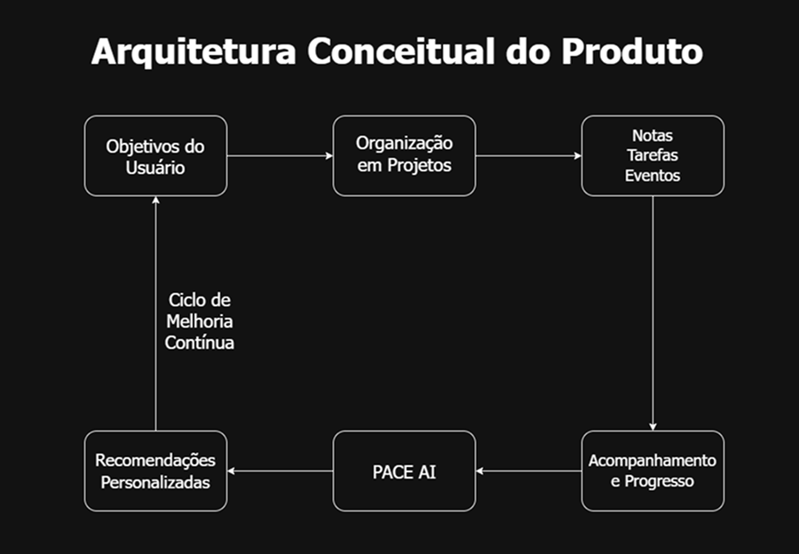
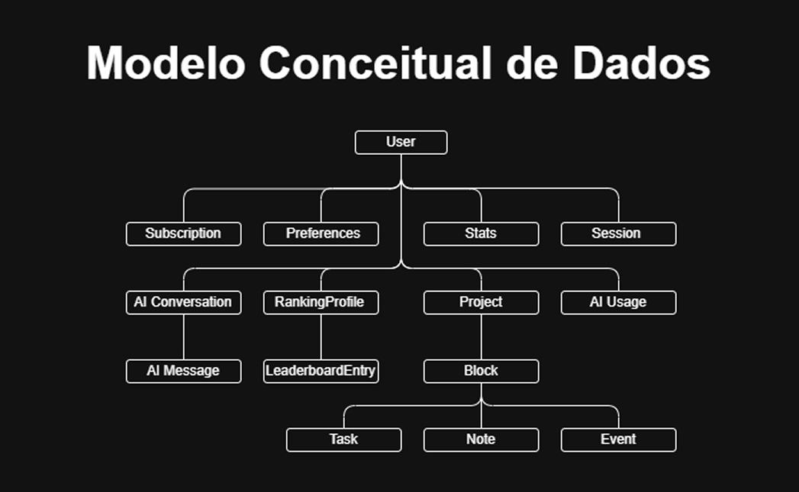

# PACE Engineering Whitepaper

**Arquitetura de Produto, Engenharia de Software e Infraestrutura de Inteligência Artificial**

Versão 1.0 • 2026

---

# 1. Resumo Executivo

O PACE é uma plataforma premium de produtividade com Inteligência Artificial desenvolvida para ajudar usuários a organizar projetos, notas, tarefas e eventos dentro de um sistema unificado centrado em projetos.

A plataforma parte de um princípio simples: toda informação deve estar inserida em um contexto. Em vez de tratar notas, tarefas e eventos como elementos isolados, o PACE organiza todo o trabalho do usuário em uma estrutura hierárquica de projetos e subprojetos, proporcionando maior clareza sobre objetivos, prioridades e progresso.

Além das funcionalidades tradicionais de produtividade, o PACE incorpora um assistente especializado em Inteligência Artificial, disponível para assinantes premium, que auxilia os usuários na estruturação de projetos, na organização de fluxos de trabalho e no uso eficiente da plataforma.

Do ponto de vista técnico, o PACE está sendo desenvolvido como uma plataforma SaaS moderna, com aplicativo mobile em React Native e Expo, backend em NestJS e PostgreSQL, sistema de assinaturas com AbacatePay e infraestrutura de IA baseada em Python, LangChain, Chroma e Ollama.

Este whitepaper apresenta a visão do produto, seus princípios fundamentais e a arquitetura tecnológica que sustenta o desenvolvimento da plataforma.

---

# 2. O Problema

Ferramentas de produtividade modernas oferecem uma ampla variedade de recursos, mas frequentemente tratam informações como elementos desconectados. Notas, tarefas e eventos costumam ser armazenados em listas separadas, sem uma estrutura clara que evidencie sua relação com objetivos e projetos mais amplos.

Essa fragmentação reduz a compreensão do contexto em que o trabalho é realizado e dificulta a manutenção de sistemas organizacionais consistentes ao longo do tempo. À medida que as informações se acumulam, torna-se mais difícil identificar prioridades, acompanhar o progresso e preservar o foco.

Além disso, muitas plataformas assumem que o usuário já sabe como estruturar seus projetos e fluxos de trabalho. Na prática, grande parte das pessoas possui objetivos e responsabilidades bem definidos, mas carece de um método claro para transformar essas demandas em uma estrutura organizada e sustentável.

O resultado é um ambiente digital marcado por excesso de informação, desorganização e dificuldade em manter produtividade de forma consistente.

---

# 3. A Solução PACE

O PACE foi concebido para oferecer uma abordagem mais contextualizada e estruturada à produtividade pessoal e profissional.

Na plataforma, projetos constituem a unidade central de organização. Cada nota, tarefa e evento é associado a um projeto específico, que pode ser organizado em uma hierarquia de pastas e subprojetos. Essa estrutura permite que o usuário compreenda o contexto de cada atividade e mantenha uma visão clara de seus objetivos.

Sobre essa base organizacional, o PACE oferece dashboards, visualizações semanais, estatísticas de produtividade e mecanismos de higiene digital, como o Auto-Purge, que ajuda a reduzir o acúmulo de informações obsoletas.

Complementando essa estrutura, o PACE AI atua como um assistente especializado que analisa o contexto do usuário e fornece recomendações práticas para organização de projetos, definição de fluxos de trabalho e melhor aproveitamento da plataforma.

Ao integrar organização contextual, design de produto e Inteligência Artificial, o PACE busca transformar a produtividade em um sistema mais claro, sustentável e adaptado às necessidades de cada usuário.

---

# 4. Princípios Fundamentais

O desenvolvimento do PACE é orientado por três princípios que definem tanto a filosofia do produto quanto suas decisões de arquitetura e design.

### Contexto

Toda informação deve estar associada a um projeto. Essa relação fornece significado às notas, tarefas e eventos, permitindo que cada item seja compreendido dentro de um objetivo maior.

### Ordem

A organização é tratada como um elemento estrutural do sistema. Projetos hierárquicos, dashboards e mecanismos de categorização permitem ao usuário construir um ambiente digital claro e consistente.

### Foco

O PACE busca reduzir o excesso de informação e direcionar a atenção do usuário para o que é realmente importante. Recursos como estatísticas, visualizações de progresso, Auto-Purge e o assistente de IA ajudam a manter um sistema de produtividade sustentável ao longo do tempo.

---

# 5. Arquitetura do Produto

O PACE foi projetado para transformar objetivos e responsabilidades em um sistema estruturado de organização e execução.

A jornada começa com os objetivos do usuário, definidos durante o onboarding e refinados ao longo do uso da plataforma. Esses objetivos são organizados em projetos e subprojetos, que funcionam como o contexto central para todas as informações armazenadas no sistema.

Dentro de cada projeto, o usuário pode criar três tipos principais de blocos:

- Notas
- Tarefas
- Eventos

Esses blocos representam o núcleo operacional da plataforma. A partir deles, o PACE gera dashboards, visualizações semanais e indicadores de produtividade que ajudam o usuário a acompanhar prioridades, progresso e padrões de trabalho.

O PACE AI utiliza esse contexto estruturado para oferecer recomendações práticas sobre organização, definição de fluxos de trabalho e uso mais eficiente da plataforma.

O diagrama abaixo resume a arquitetura conceitual do produto.

Essa estrutura reflete a principal proposta do PACE: transformar informações dispersas em um sistema organizado, contextualizado e assistido por Inteligência Artificial.

---

# 6. Experiência do Usuário e Fluxo de Trabalho

A experiência do usuário no PACE foi concebida para ser progressiva, intuitiva e altamente contextualizada.

O processo se inicia com um onboarding personalizado, no qual o usuário define objetivos, áreas de interesse e preferências. Essas informações servem como base para a configuração inicial do sistema e para a atuação do PACE AI.

Após o onboarding, o usuário cria projetos e subprojetos para representar diferentes áreas da vida pessoal, acadêmica e profissional, como estudos, trabalho, finanças ou projetos de longo prazo.

Dentro de cada projeto, podem ser adicionados:

- Notas em Markdown para registro e organização do conhecimento;
- Tarefas para planejamento e acompanhamento de atividades;
- Eventos para compromissos e marcos temporais.

À medida que essas informações são inseridas, o PACE gera dashboards, cronogramas e estatísticas que fornecem uma visão consolidada do trabalho em andamento.

Assinantes premium têm acesso ao PACE AI, que utiliza o contexto criado pelo usuário para sugerir estruturas de projetos, otimizar fluxos de trabalho e orientar o uso da plataforma.

O fluxo de utilização da plataforma pode ser resumido nas seguintes etapas:

1. Definição de objetivos e preferências;
2. Criação da estrutura de projetos;
3. Registro de notas, tarefas e eventos;
4. Acompanhamento por dashboards e visualizações;
5. Interação com o PACE AI;
6. Refinamento contínuo do sistema de produtividade.

Essa abordagem transforma a produtividade em um processo iterativo, no qual organização, execução e melhoria contínua são integradas em uma única plataforma.

---

# 7. Stack Tecnológica

O PACE está sendo desenvolvido com uma arquitetura moderna e modular, na qual cada tecnologia é escolhida de acordo com sua especialidade e papel dentro do sistema.

### Aplicativo Mobile
- React Native
- Expo
- TypeScript

### Backend
- Node.js
- NestJS
- PostgreSQL
- Prisma ORM
- Autenticação com JWT

### Pagamentos e Assinaturas
- AbacatePay

### Infraestrutura de Inteligência Artificial
- Python
- LangChain
- Chroma Vector Database
- Ollama
- Retrieval-Augmented Generation (RAG)

### Infraestrutura e Deploy
- Docker
- Railway (MVP)
- AWS (expansão futura)

---

# 8. Arquitetura Mobile

O aplicativo mobile do PACE é a principal interface de interação com a plataforma e está sendo desenvolvido com React Native e Expo, utilizando TypeScript para garantir segurança de tipos e maior robustez no desenvolvimento.

A navegação é baseada em Expo Router, com organização por rotas e arquitetura orientada a funcionalidades. O estado da aplicação é gerenciado por meio de React Context e, durante a fase atual de desenvolvimento, os dados são armazenados localmente com AsyncStorage.

O modelo central da aplicação é o conceito de Block, uma união discriminada de três tipos de entidades:

- Task
- Note
- Event

Todos os blocos pertencem a um projeto específico, preservando a filosofia de organização contextual da plataforma.

A estratégia de desenvolvimento é local-first, permitindo que o frontend evolua de forma independente enquanto a infraestrutura de backend é construída.

---

# 9. Arquitetura Backend

O backend do PACE será implementado em NestJS, seguindo uma arquitetura modular e orientada a domínios.

Sua principal responsabilidade será substituir a persistência local por uma infraestrutura centralizada, oferecendo autenticação, armazenamento em nuvem, sincronização de dados, controle de assinaturas e acesso ao assistente de IA.

Os principais módulos previstos incluem:

- Auth
- Users
- Projects
- Blocks
- Preferences
- Sessions
- Stats
- Subscriptions
- Payments
- AI
- Admin

O backend exporá uma API REST consumida pelo aplicativo mobile e atuará como camada central de regras de negócio e segurança da plataforma.

---

# 10. Modelagem de Dados

O modelo de dados do PACE reflete a estrutura conceitual do produto.

As principais entidades do sistema são:

- User
- Project
- Block
- Subscription
- Preferences
- Session
- Stats
- OnboardingProfile
- AIConversation
- AIMessage
- AIUsage

Projects formam uma árvore hierárquica por meio do campo `parentId`. Blocks representam notas, tarefas e eventos e são associados a projetos por `projectId`.

Esse modelo preserva no banco de dados a mesma estrutura utilizada no frontend, simplificando a sincronização e a evolução do sistema.

---

# 11. Assinaturas e Billing

O PACE adota um modelo de assinatura premium.

Usuários gratuitos terão acesso às funcionalidades básicas de organização, enquanto recursos avançados, incluindo o PACE AI, serão disponibilizados exclusivamente para assinantes.

O processamento de pagamentos será realizado por meio do AbacatePay, com suporte a PIX e cartão de crédito.

O backend será responsável pela criação de assinaturas, processamento de webhooks, atualização do status do usuário, controle de acesso premium e registro do histórico de pagamentos.

---

# 12. Segurança e Privacidade

A segurança da plataforma será baseada em autenticação com JSON Web Tokens (JWT) e controle de acesso por usuário autenticado.

Cada usuário terá acesso apenas aos seus próprios projetos, blocos, conversas e estatísticas.

As principais práticas de segurança incluem:

- Hash de senhas;
- Validação de entrada;
- Isolamento de dados por usuário;
- Verificação de assinatura premium;
- Rate limiting;
- Logs e monitoramento.

---

# 13. Estratégia de Escalabilidade

O PACE está sendo desenvolvido com foco em um MVP para até aproximadamente 100 usuários, priorizando simplicidade e rapidez de implementação.

A arquitetura, entretanto, foi projetada para evoluir de forma gradual.

### MVP
- Aplicativo mobile
- API NestJS monolítica
- PostgreSQL
- AbacatePay
- Serviço de IA com Python e Ollama
- Deploy em Railway

### Expansão
- Redis para cache e filas
- Serviços desacoplados
- Infraestrutura em AWS
- Escalabilidade horizontal
- Modelos de IA hospedados em servidores dedicados

---

# 14. O Assistente PACE AI

O PACE AI é um assistente especializado em produtividade e organização, desenvolvido exclusivamente para atuar dentro do contexto da plataforma PACE.

Seu escopo é ajudar os usuários a estruturar projetos, organizar fluxos de trabalho e utilizar a plataforma de maneira mais eficiente.

O assistente utiliza informações contextuais fornecidas pelo próprio usuário, incluindo objetivos definidos no onboarding, hierarquia de projetos, notas, tarefas, eventos, preferências pessoais e plano de assinatura.

Com base nesse contexto, o PACE AI pode sugerir estruturas de projetos, recomendar métodos de organização, propor fluxos de trabalho, explicar funcionalidades da plataforma e identificar oportunidades de melhoria no sistema de produtividade.

---

# 15. Arquitetura RAG

O PACE AI será implementado com uma arquitetura de Retrieval-Augmented Generation (RAG), permitindo que o modelo de linguagem responda com base em informações específicas da plataforma e no contexto individual de cada usuário.

## Pipeline Offline

1. Documentação do produto e conteúdos especializados são convertidos em texto.
2. O conteúdo é dividido em pequenos trechos (chunks).
3. Cada trecho é transformado em embeddings vetoriais.
4. Os vetores são armazenados no Chroma Vector Database.

## Pipeline Online

1. A pergunta é convertida em embedding.
2. Os trechos semanticamente mais relevantes são recuperados.
3. O contexto do usuário é combinado com esses trechos.
4. Um prompt estruturado é enviado ao modelo.
5. O modelo gera uma resposta contextualizada.

---

# 16. Roadmap de Desenvolvimento

O desenvolvimento do PACE está sendo conduzido em etapas progressivas.

### Fase 1 — Frontend Mobile
- Estrutura do aplicativo em React Native e Expo
- Navegação, dashboards e gerenciamento local de dados

### Fase 2 — Backend e Persistência
- API em NestJS
- PostgreSQL e Prisma
- Autenticação e sincronização em nuvem

### Fase 3 — Assinaturas e Billing
- Integração com AbacatePay
- Controle de acesso premium

### Fase 4 — Inteligência Artificial
- Serviço de IA em Python
- RAG com LangChain, Chroma e Ollama

### Fase 5 — MVP e Validação
- Lançamento para usuários iniciais
- Coleta de feedback e refinamento do produto

---

# 17. Sobre o Criador

O PACE está sendo desenvolvido por Gabriel Machado como seu principal projeto de Engenharia de Software e Inteligência Artificial.

Além de representar um produto comercial em desenvolvimento, o PACE funciona como um laboratório prático para o estudo e aplicação de arquiteturas modernas de software, SaaS e sistemas baseados em LLMs.

---

# 18. Conclusão

O PACE foi concebido para oferecer uma abordagem mais contextualizada, estruturada e inteligente à produtividade.

Ao integrar organização centrada em projetos, dashboards, mecanismos de higiene digital e um assistente especializado em Inteligência Artificial, a plataforma busca transformar a maneira como usuários planejam, executam e evoluem seus sistemas de trabalho.

Mais do que um aplicativo de produtividade, o PACE representa a convergência entre design de produto, engenharia de software e sistemas de IA aplicados à resolução de problemas reais de organização e foco.
